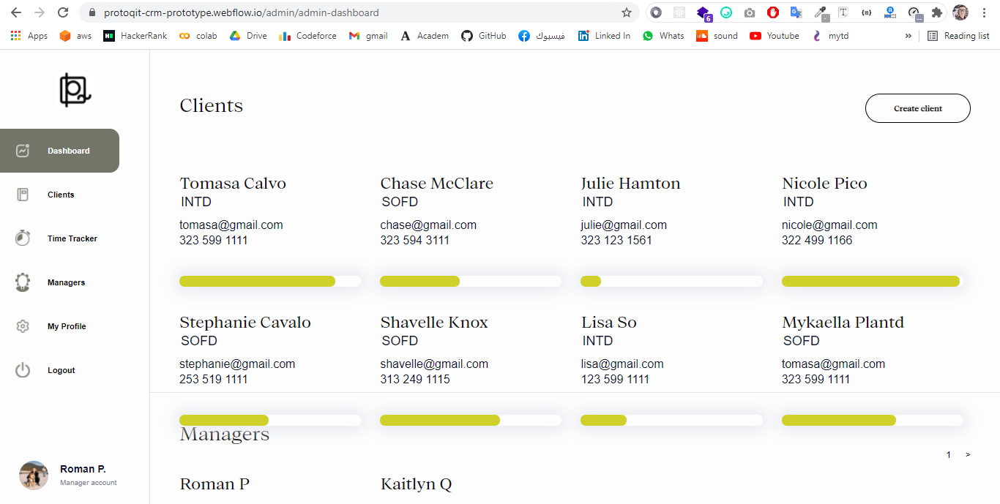
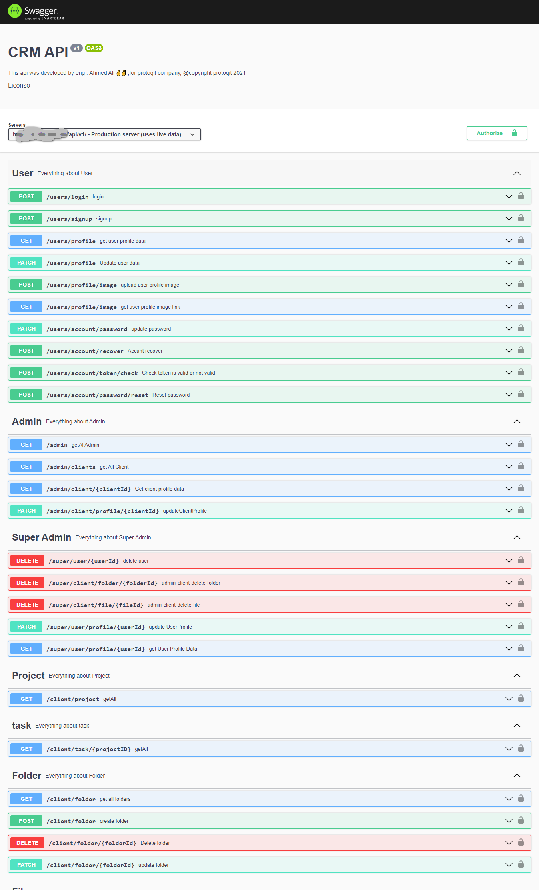
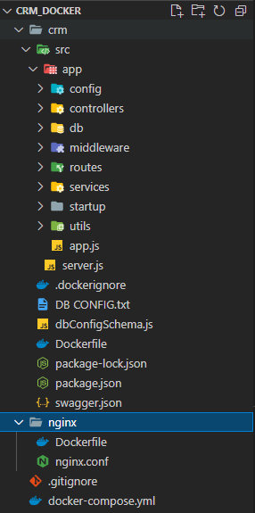

#                                                                                   Protoqit_CRM
## Welcome! 👋
This project is client relationship management website for [(Protoqit company )](https://www.protoqit.com/about-us),(USA-California),
I developed the backend api for this website 👨‍💻.

### Built with:
<ul>
<li class="has-line-data" data-line-start="15" data-line-end="16">Restful Api</li>
<li class="has-line-data" data-line-start="16" data-line-end="17">Node.js</li>
<li class="has-line-data" data-line-start="17" data-line-end="18">Express</li>
<li class="has-line-data" data-line-start="18" data-line-end="19">PostgreSQL</li>
<li class="has-line-data" data-line-start="19" data-line-end="20">jsonwebtoken (JWT)</li>
<li class="has-line-data" data-line-start="20" data-line-end="21">nodemailer</li>
<li class="has-line-data" data-line-start="21" data-line-end="22">joi</li>
<li class="has-line-data" data-line-start="21" data-line-end="18">AWS s3</li>
<li class="has-line-data" data-line-start="22" data-line-end="19">AWS EC2</li>
<li class="has-line-data" data-line-start="23" data-line-end="20">Nginx</li>
<li class="has-line-data" data-line-start="24" data-line-end="21">Swagger</li>
<li class="has-line-data" data-line-start="25" data-line-end="22">Docker</li>
</ul>

### Site features:

#### Client:
 <ul>
<li class="has-line-data" data-line-start="15" data-line-end="16">create folders</li>
<li class="has-line-data" data-line-start="15" data-line-end="16">update/delete his folders</li>
<li class="has-line-data" data-line-start="16" data-line-end="17">add files for his folders</li>
<li class="has-line-data" data-line-start="15" data-line-end="16">update/delete his files</li>
<li class="has-line-data" data-line-start="16" data-line-end="17">see his projects</li>
<li class="has-line-data" data-line-start="16" data-line-end="17">see his projects milestons and milestones state (done/not done)</li>
<li class="has-line-data" data-line-start="19" data-line-end="20">client will receive email and sms when any milestone is done</li>
<li class="has-line-data" data-line-start="19" data-line-end="20">client can update his profiles data</li>
<li class="has-line-data" data-line-start="19" data-line-end="20">client can track the time of projects through the site and through notifications of different types</li>
</ul>

#### Admin:
 <ul>
<li class="has-line-data" data-line-start="15" data-line-end="16">create new client</li>
<li class="has-line-data" data-line-start="16" data-line-end="17">add projects for clients</li>
<li class="has-line-data" data-line-start="15" data-line-end="16">update/delete clients projects</li>
<li class="has-line-data" data-line-start="19" data-line-end="20">add milestons for clients projects</li>
<li class="has-line-data" data-line-start="15" data-line-end="16">update/delete projects milestons</li>
<li class="has-line-data" data-line-start="19" data-line-end="20">mark milestons is done for clients projects</li>
<li class="has-line-data" data-line-start="17" data-line-end="18">create folders for any client</li>
<li class="has-line-data" data-line-start="18" data-line-end="19">add files for any client</li>
<li class="has-line-data" data-line-start="19" data-line-end="20">Update clinets profiles data</li>
 <li class="has-line-data" data-line-start="19" data-line-end="20">can see progress par for projects tracker</li>
</ul>

#### Super admin:
 <ul>
<li class="has-line-data" data-line-start="18" data-line-end="19">have all admin features</li>
<li class="has-line-data" data-line-start="19" data-line-end="20">delete client</li>
<li class="has-line-data" data-line-start="19" data-line-end="20">delete clients folders</li>
<li class="has-line-data" data-line-start="19" data-line-end="20">delete clients files</li>
<li class="has-line-data" data-line-start="19" data-line-end="20">Make the admin a client and versa</li>
<li class="has-line-data" data-line-start="19" data-line-end="20">Super admin can see all things and control all things</li>
</ul>

### Site UI :

### Swagger:

### Project folders structure:

### Source code is privet because is ownered to Protoqit company 🤷‍♂️.

#### But you can contact me if you want to inquire about something
### You can see the some site pages in design folder😃.
## Author
- LinkedIn - [@AhmedAliAhmedAbdAl-Mowla](https://www.linkedin.com/in/ahmed-ali-ahmed-abd-al-mowla-630284158/)

